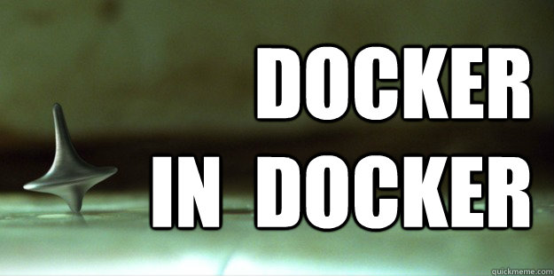

# 7. Jenkins notre Factory Docker
Le but de cette septième étape est de transformer notre Jenkins en une véritable factory de conteneur Docker. Notre conteneur Jenkins sera en mesure de packager une application web Java depuis les sources en un conteneur, l'exécution de ce nouveau conteneur permettra de lancer la webapp.  
Nous dispons déjà du job jenkins permettant d'effectuer le build depuis les sources en une archive WAR (cf: [exercice 5](../05_jenkins_container), il ne nous reste plus qu'à ajouter la partie permettant de construire dynamiquement les conteneur à partir d'un WAR.


## a. Docker In Docker
Notre conteneur Jenkins a donc besoin d'utiliser le binaire docker pour construire dynamiquement des conteneurs. Ce qui revient donc à faire du.... Docker in Docker!



Pour cela nous allons utiliser l'image de base ["dind"](https://github.com/jpetazzo/dind/) dans notre conteneur Jenkins. Vous pouvez donc reprendre votre conteneur Jenkins de [l'exercice 5](../05_jenkins_container) et modifier la commande FROM.  


## b. Factory Script
Ecrire un script bash permettant de crééer dynamiquement des conteneurs Docker contenant la webapp. Ce script sera executé par le plugin Jenkins "post build task" juste après la phase de build du war.


Afin de tester le script, vous pouvez exécuter votre conteneur Jenkins en mode interactif et écrire directement le script dans le conteneur.

* Votre script doit récupérer le chemin du WAR qui a été build par Jenkins. Astuce pour récupérer le chemin du dernier war build par Jenkins:
```shell
webapp_filepath=$(ls -tR | grep -E "^*.war$" | head -1)
```

* Puis vous devez écrire le Dockerfile qui permet d'ajouter ce WAR dans un conteneur. Il faut également ajouter à ce Dockerfile le package tomcat, ou tout autre container de servlet permettant d'éxecuter le WAR.

* Le nom de la webapp est dynamique, il faut donc que l'on puisse passer une variable au Dockerfile contenant le chemin de la webapp. Pour cela nous allons utiliser un template pour notre Dockerfile. Ainsi la commande ADD de notre template "Dockerfile.template" contiendra la variable ${WEBAPP_WAR_FILEPATH} et notre script devra générer le Dockerfile à partir de ce Dockerfile:

```shell
cat /Dockerfile.template | sed -e "s:\${WEBAPP_WAR_FILEPATH}:target/$webapp_filepath:g" > Dockerfile
```

* le script peut maintenant build le conteneur

* Et enfin il peut executer le conteneur, récupérer ses informations réseaux: IP/PORT et les afficher dans les logs. Testez votre webapp deployé dans le conteneur.


## c. Post Build Task
Cette dernière étape consiste à ajouter le script au plugin Jenkins "Post build task". Comme dans [l'exercice 5](../05_jenkins_container), nous vous fournissons les fichiers de configurations Jenkins, la seule contrainte est que le nom de votre script doit être "build_docker_webbapp.sh"
